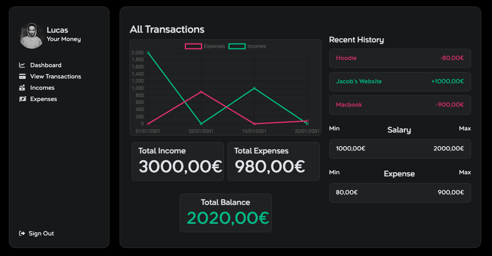
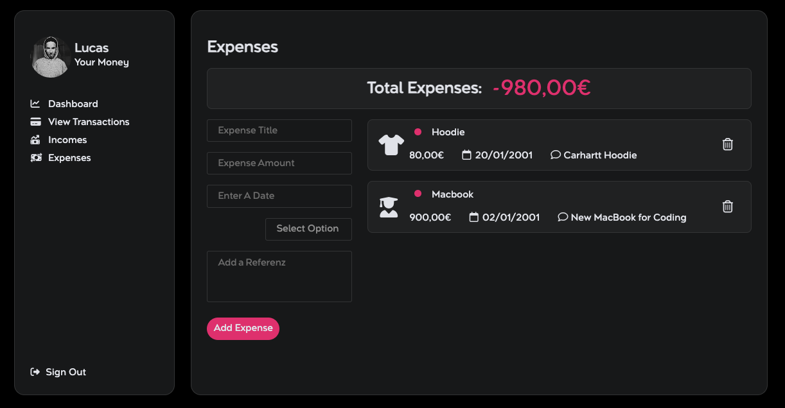
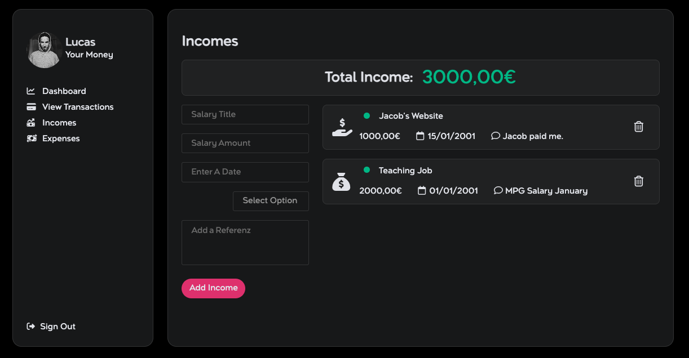

# Building an Expenses & Income Tracker App

I did this project to improve my JS-Skills. Main goal was originally to learn OOP.

## Table of contents

- [Overview](#overview)
- [The challenge](#the-challenge)
- [Links](#links)
- [My process](#my-process)
- [Built with](#built-with)
- [What I learned](#what-i-learned)
- [Screenshot](#screenshot)

## Overview

- I build the project with vanilla HTML, CSS & JS. Also included chart.js for the graph.
- I used a screenshot as design assistence.

### The challenge

Users should be able to:

- Add and delete expenses and income. See the calculated total balance, recent history and graph of all their transactions.
- Data should be stored in the localStorage of the browser.

### Links

- Live Site URL: [https://lucasregalar.github.io/Expense-Tracker/](https://lucasregalar.github.io/Expense-Tracker/)

### Built with

- Semantic HTML5 markup
- CSS custom properties
- Flexbox
- chart.js
- JS

### What I learned

-basic principles of OOP
-how to dynamiclly create and delete HTML-Elements (incl. buttons and click-events on them)
-dark-theme color rules
-local Storage
-CSS BEM
-including icons

### Screenshot

